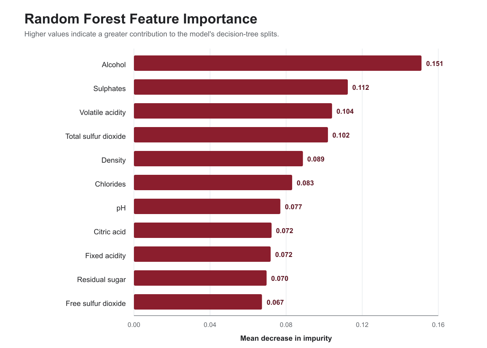

# Red Wine Quality Analysis

A notebook-based team project using the Red Wine Quality dataset. This README
documents the repository layout and how to reproduce the existing notebooks;
it does not change the analysis, models, or project question.

## Repository layout

```text
data/       Source dataset and dataset attribution
notebooks/  Analysis notebooks in execution order
output/     Shared data splits and saved model-result tables
```

## Notebook order

1. `00_data_preparation.ipynb`
2. `01_eda.ipynb`
3. `02_logistic_regression.ipynb`
4. `03_knn.ipynb`
5. `04_decision_tree.ipynb`
6. `05_random_forest.ipynb`
7. `06_neural_network.ipynb`
8. `07_final_comparison.ipynb`

The notebooks use relative paths, so open them from the `notebooks/`
directory and run the data-preparation notebook before the model notebooks.

## Local setup

Python 3.10 was used for the project environment.

```powershell
python -m venv .venv
.\.venv\Scripts\Activate.ps1
python -m pip install --upgrade pip
pip install -r requirements.txt
```

Then select the virtual environment as the notebook kernel in PyCharm,
Jupyter, or another notebook interface.

## Data and attribution

The tracked source file is `data/winequality-red.csv`. Dataset provenance,
licensing, and the requested citation are documented in `data/README.md`.

## Generated outputs

The existing notebooks exchange train/test splits and one-row model result
tables through `output/`. Run notebooks in the order shown above if those
artifacts need to be regenerated.

## Key finding: physicochemical feature importance

Random Forest was the strongest-performing model in the project. Its feature
importance analysis ranked **alcohol**, **sulphates**, **volatile acidity**,
**total sulfur dioxide**, and **density** as the five most important inputs to
its wine-quality predictions.



The complete ranked values are available in
[`results/tables/random_forest_feature_importance.csv`](results/tables/random_forest_feature_importance.csv),
and the calculation is documented in
[`notebooks/05_random_forest.ipynb`](notebooks/05_random_forest.ipynb).

These values measure predictive importance within the fitted Random Forest;
they do not establish that a property causes wine quality to change or indicate
the direction of a relationship. The exploratory analysis provides additional
context: alcohol had an approximately +0.48 correlation with quality, while
volatile acidity had an approximately -0.39 correlation.

## Team project

Before using this repository in a personal portfolio, add a short section
describing your individual contribution and credit the other contributors.
