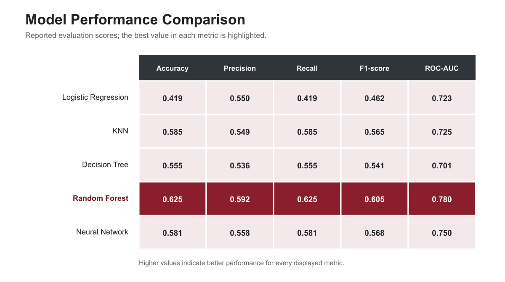

# Red Wine Quality Classification

A notebook-based machine-learning study comparing five classifiers for
predicting expert-assigned red wine quality ratings from physicochemical
measurements. The project also examines which measured properties contribute
most strongly to the models' predictions.

## Project overview

Wine quality is commonly assessed through expert sensory evaluation. This
project investigates whether routinely collected laboratory measurements can
support that assessment by predicting quality scores from 3 to 8.

The source dataset contains 1,599 Portuguese vinho verde red wine records and
11 numerical physicochemical inputs. Data preparation removed 240 duplicate
records, leaving 1,359 unique observations for the modeling workflow. The five
evaluated classifiers were Logistic Regression, K-Nearest Neighbors, Decision
Tree, Random Forest, and a multilayer perceptron neural network.

### Project objectives

- Compare five multiclass classification models using a shared stratified data
  split and a consistent set of reported metrics.
- Identify the physicochemical properties most important to wine-quality
  predictions.
- Communicate model performance, feature importance, and project limitations
  through reproducible notebooks and exported results.

## Technology

- Python and Jupyter Notebook
- pandas and NumPy for data preparation
- scikit-learn for preprocessing, modeling, and evaluation
- Matplotlib and Seaborn for visualization

## Repository layout

```text
data/       Source dataset and attribution
notebooks/  Data preparation, EDA, models, and final comparison
output/     Shared data splits and original model-result files
results/    Portfolio-facing figures and ranked result tables
```

## Notebook order

1. `00_data_preparation.ipynb`
2. `01_eda.ipynb`
3. `02_logistic_regression.ipynb`
4. `03_knn.ipynb`
5. `04_decision_tree.ipynb`
6. `05_random_forest.ipynb`
7. `06_neural_network.ipynb`
8. `07_final_comparison.ipynb`

The notebooks use relative paths, so open them from the `notebooks/`
directory and run the data-preparation notebook before the model notebooks.

## Local setup

Python 3.10 was used for the project environment.

```powershell
python -m venv .venv
.\.venv\Scripts\Activate.ps1
python -m pip install --upgrade pip
pip install -r requirements.txt
```

Then select the virtual environment as the notebook kernel in PyCharm,
Jupyter, or another notebook interface.

## Data and attribution

The tracked source file is `data/winequality-red.csv`. Dataset provenance,
licensing, and the requested citation are documented in `data/README.md`.

## Generated outputs

The existing notebooks exchange train/test splits and one-row model result
tables through `output/`. Run notebooks in the order shown above if those
artifacts need to be regenerated.

## Model comparison

Using the F1-score selection criterion in the existing comparison notebook,
**Random Forest** produced the strongest result with an F1-score of 0.605. It
also had the highest reported accuracy (0.625) and ROC-AUC (0.780) among the
five evaluated models.



The complete metrics are available in
[`results/tables/model_comparison.csv`](results/tables/model_comparison.csv),
and the comparison workflow is documented in
[`notebooks/07_final_comparison.ipynb`](notebooks/07_final_comparison.ipynb).

## Key finding: physicochemical feature importance

Random Forest was the strongest-performing model in the project. Its feature
importance analysis ranked **alcohol**, **sulphates**, **volatile acidity**,
**total sulfur dioxide**, and **density** as the five most important inputs to
its wine-quality predictions.


The complete ranked values are available in
[`results/tables/random_forest_feature_importance.csv`](results/tables/random_forest_feature_importance.csv),
and the calculation is documented in
[`notebooks/05_random_forest.ipynb`](notebooks/05_random_forest.ipynb).

These values measure predictive importance within the fitted Random Forest;
they do not establish that a property causes wine quality to change or indicate
the direction of a relationship. The exploratory analysis provides additional
context: alcohol had an approximately +0.48 correlation with quality, while
volatile acidity had an approximately -0.39 correlation.

## Evaluation scope and limitations

This repository preserves the original course-project experiment and its
reported results. In the KNN notebook, the value of `k` is selected using the
test partition, and the same test partition is subsequently used in the final
five-model comparison. Therefore, the comparison values should be treated as
the project's reported evaluation results rather than as an unbiased estimate
from a final untouched test set. A future methodological revision should move
all tuning and model selection into cross-validation performed only on the
training data.

Additional limitations include the moderate dataset size, strong concentration
of observations in quality classes 5 and 6, and the subjectivity present in the
expert-assigned target ratings. Feature importance describes model behavior and
should not be interpreted as evidence of causation.

## Team and contributions

This project was completed by **Audrey Galle Brual, Luan Hoang Le, Lydia
Protsenko, and Arvin Gill** for DATA 221 at the University of Calgary.

### Luan Hoang Le — individual contribution

- Created and maintained the shared data-preparation workflow and saved
  train/test artifacts used by the model notebooks.
- Implemented and evaluated the Random Forest classifier, including its
  confusion matrix, classification metrics, ROC-AUC, and feature-importance
  analysis.
- Integrated the model-result files into the final five-model comparison and
  prepared the exported comparison and feature-importance results.
- Organized and documented the public repository for reproducibility and
  portfolio presentation.

The other team members contributed the EDA and Logistic Regression analysis
(Audrey Galle Brual), KNN and neural-network analysis (Lydia Protsenko), and
Decision Tree and ROC-AUC analysis (Arvin Gill).
